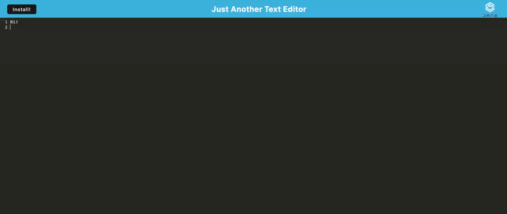

# Text Editor Starter Code

## Description
Internet is a luxury not everyone can afford or have access to depending on where they live. Given starter code, I have created a text editor that users can write in to store notes, song lyrics, code snippets, etc. 
For the storage functionality, I set up a service worker to run "behind the scenes." The service worker caches users' text so that it is accessible whenever the application is opened, regardless of the users' internet capability. The app can be run in the browser or installed locally on the computer.

When starting the Progressive Web App module, we were told that we would run into technical issues with plugins and packages, but while completing this assignment I ran into an additional issue I wasn't expecting. First, I received an error that my service worker was not being registered correctly. After reinstalling all of my node modules several times, the error was replaced with one that said `ERROR in Multiple instances of self.__WB_MANIFEST were found in your SW source. Include it only once. For more info, see https://github.com/GoogleChrome/workbox/issues/2681"`. 
After five hours of troubleshooting by myself and with TAs and tutors, no solution was found. The app still runs correctly but for some reason, the header image will not display.

I am personally bothered by my app not being perfect, but such is the life of a dev!

Link to deployed app: https://notes-on-the-go-app.herokuapp.com/

## Installation
1. Copy the SSH key in my GitHub repo and paste `git clone <SSHKEY>` in your terminal to create a local copy on your computer\
OR
2. Download the zip file and manually copy the files to your computer
3. Install node by copying and pasting the code `npm init -y` in your terminal
4. Run `npm i` to install the necessary applications 

## Usage
1. Open the root folder in your terminal
2. Run `npm run build` to initialize WebPack
3. Run `npm run start:dev` to start the server to view the app in localhost 8080\
OR 
4. Run `npm run start` to start the server on a local port (header image will display here!)
5. Once the app opens, type in the text window to write 
6. Click out of the window, refresh the page, and you'll see that your text still saves
6. Click the 'install' button to install the app to your computer

## Credits 
I created this app using JavaScript, CSS, Node.js, Express.js, WebPack, and Babel. I used Heroku for deployment.

- [Mozilla ObjectStore methods](https://developer.mozilla.org/en-US/docs/Web/API/IDBObjectStore/put)

## License
MIT License